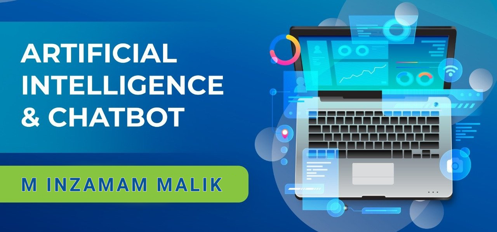

<h1 align='center'>Generative AI Chatbot Course</h1>
<h2 align='center'>🖥 Building and Integrating Artificial Intelligence Chatbots and Voice Applications with Dialogflow and ChatGPT3</h2>
<h4 align='center'><i>Talk to the future of computing.</i></h4>

|               |                                                          |
| :------------ | :------------------------------------------------------- | ------------------------------ |
| Prerequisites | Basic programming knowledge                              | List all new or modified files |
| Instructor    | [M. Inzamam Malik](https://www.linkedin.com/in/minzamam) |
| Duration      | 6 Months                                                 |
| Stack         | `OP stack  (OpenAI + Pinecone)`                          |

 <!-- Google Assistant apps you will learn latest technologies Google Dialoglfow v2,  -->

## Objective

In this course you will learn how to make state of the art AI Chatbots with `OP stack  (OpenAI + Pinecone)` 
[ChatGPT](https://openai.com/blog/chatgpt) is a new kind of `AI as a Service (AIaaS)` which is gaining significant traction. In the foreseeable future, only large corporations will be responsible for creating their own AI models, while smaller entities will rely on pre-trained, general-purpose models such as ChatGPT. As an AI developer and chatbot expert, I opine that while ChatGPT may not yet be at the peak of its potential, it is poised to make substantial progress in the near future.

This course will offer comprehensive insights not only on ChatGPT APIs but also provide guidance on how such new forms of AI can be utilized by application developers. With the ChatGPT gold rush already underway, the ultimate aim of this course is to equip participants with the necessary skills to become part of this technological revolution.

## Who Is This Course for?

This course is designed for aspiring AI developers and Chat-bot enthusiasts, and application developers who are eager to explore the world of `state-of-the-art AI Chat-bots`. Whether you are a seasoned programmer or just starting your journey into the realm of artificial intelligence, this comprehensive course will equip you with the necessary skills to become a part of the `technological revolution driven by AIaaS`.

**Just basic Programming knowledge is required in any language,** No prior experience with Python is required, as the course focuses on JavaScript, making it accessible to a wider audience. If you are intrigued by the potential of AI-powered Chat-bots and wish to `leverage pre-trained, general-purpose models` like ChatGPT to build innovative applications, this course will provide you with the knowledge and insights to do so effectively.

## Course outline

### Overview

- **`Git`**, **`HTML`** and **`CSS`** overview
- **`JavaScript`** (ES6+) &nbsp;&nbsp;&nbsp;&nbsp;~~No Python~~
- **`NodeJS`**, **`ExpressJS`**
- **`MongoDB`**
- **`DialogFlow`**
- **`OpenAI's ChatGPT API (fine-tuning)`**
- **`Whisper API`**
- **`Pinecone (Vector database)`**

### Details

1. In weak one we will have an overview of :

   - [`Git and Github`](https://rogerdudler.github.io/git-guide/). [(Video)](https://youtu.be/vbH9gMqJ5GQ)
   - [`HTML`](https://youtu.be/HcOc7P5BMi4) and [`CSS`](https://youtu.be/Edsxf_NBFrw).
     (1 week) [Book Link](<https://github.com/shehza-d/Learning-Resources/blob/main/02.Starting-of-Development(HTML)/00.Web_development_book(jon-ducket).pdf>)

1. Exploring the possibilities of future with [`Apple's Vision Pro`](https://www.youtube.com/live/GYkq9Rgoj8E?feature=share) and ChatGPT.
1. [`JavaScript`](https://www.youtube.com/playlist?list=PLu0W_9lII9ahR1blWXxgSlL4y9iQBnLpR) programming fundamental (ES6+) (3 weeks)
   | | |
   | --- | --- |
   | Variables | Number, String, Boolean, Array, Objects|
   |Math Operators|+ - \* / % -- ++|
   |Conditional Statements |If else, ternary operator|
   |Conditional operators| === !== < > <= >=|
   |Logical operators|&& &nbsp; \|\| &nbsp; !|
   |Loop Statements |For loop, map, for in loop|
   |ES6 functions| ()=>|
   |Async Await||

1. [REST API design principles](https://www.ibm.com/topics/rest-apis)

   Theory of

   - Rest APIs
   - http and https
   - What is [Stateless](https://www.interviewbit.com/blog/gradle-vs-maven/)?
   - What is [Caching](https://aws.amazon.com/caching/)?
   - [Micro service architecture](https://cloud.google.com/learn/what-is-microservices-architecture)
   - [Ninon service architecture](https://techbeacon.com/app-dev-testing/nanoservices-where-they-fit-where-they-dont) (AWS Lambda)

1. Writing JavaScript `Servers` with and `ExpressJS/NodeJS` (4 weeks)

   - Introduction to Servers
   - Express.js GET, POST, PUT, DELETE
   - Express.js middleware
   - Express.js Static file server

1. Hosting Node Servers

   - [Cyclic](https://www.cyclic.sh/) (1 free app without Card)
   - [Google App Engine](https://cloud.google.com/appengine) (Unlimited free apps with card)

1. &nbsp;[`MongoDB`](https://learn.mongodb.com/)

   - Introduction to MongoDB Database
   - SQL vs NoSQL (multi-region)
   - Setting up Mongodb Atlas
   - MongoDB Schema and model
   - MongoDB CRUD Operation

1. [`ReactJS`](https://daveceddia.com/react-getting-started-tutorial/) Integration (2 weeks)

   - Basic introduction to react
   - Chatbot popup using react-chat-widget in existing react.js web app
   - CRUD operation in ReactJs
   - Chat app with ReactJs.
   - React.js is not fully covered in this course!

1. Vector Databases

   - It's Long-Term Memory for AI
   - Unlock powerful search with Vector Databases.
   - Intuitive to use, designed for speed, and effortlessly scalable.

   1. [Vector Search with MongoDB](https://www.mongodb.com/library/vector-search/semantic-search-mongodb-using-atlas-vector-search)
   2. [Pinecone database](https://www.pinecone.io/)
      - Transform your business with high-performance AI applications. Pinecone's vector database is fully-managed, developer-friendly, and easily scalable.

2. What is [`Word Embedding?`](https://youtu.be/5MaWmXwxFNQ)

3. `Dialogflow` V2 (4 weeks)
   - Intent
   - Entity
   - Fulfilment
   - Context
4. 3 Real life Chatbots Integrations for hands-on practice

   - Hotel booking Assistant
   - Online Store Assistant
   - Weather Assistant

5. Introduction to the `OpenAI` Completion Model and Completion Endpoint.

6. Introduction to the OpenAI Playground.
7. How to Designing a better prompt.
8. Using `ChatGPT` in your apps for classification, generation, transformation, translation, and conversion.
9. Building Chatbots on top of ChatGPT3.
10. Supercharging `Dialogflow` Chatbots with ChatGPT webhook.
11. Assembling and uploading training data into ChatGPT.
12. `Fine-tuning` techniques.
13. Introduction to the JSONL document.
14. Introduction to OpenAI CLI tools.
15. Building your own `fine-tuned model`.
16. Entity extraction.
17. Introduction to hyper-parameters.
18. Using existing fine-tuned models.
19. Further fine-tuning on existing fine-tuned models.
20. Validating fine-tuned models for weight and biases.
21. [`Whisper API`](https://github.com/openai/whisper) is a breakthrough, Whisper is real and I have used it. It's far far better then google speech to text it understand sentences that has two languages in it, previously you had to download the model and run on your machine with 64gb ram memory but now you just have to pay as you go.

**AI as a service is the future of AI**

## Scope

Chatbot projects are highly in demand in international market, After successful completion of this
course you will be empowered to pursue exciting opportunities as a Chatbot Developer in software houses or even embark on a `freelance` journey with Fiverr and Upwork **(How to do freelancing is not covered in this course)**, tapping into the gold rush of `AIaaS` in the international market.

## Course Resources

- [Github Repo](https://github.com/mInzamamMalik/SMIT-chatbot-b3)
- [Youtube Playlist](https://youtube.com/playlist?list=PLaZSdijfCCJAaiGINILElinr8wlgNS7Vy)
- [Website to submit assignments](https://sysborg-air.web.app/)
- [WhatsApp group](https://chat.whatsapp.com/IRY1Bd1OxIpGa6lcLh8HzB)
- [List of Assignments](./Assignments.md)

## Other Resources

- [Will ChatGPT replace Humans?](https://youtu.be/84kL9fInMfQ)
- [Dialogflow knowledge base vs ChatGPT4](https://youtu.be/BZgjbCX1vVU)

 

<h4 align='center'>Readme by <a href='https://github.com/shehza-d/'>Shehzad</a></h4>

 
 
 

## Under Consideration:
#### 1. Dialogflow CX: Bot Building Basics
google qwiklab for Learning dialogflow cx https://www.cloudskillsboost.google/focuses/20841?parent=catalog

#### 2. ChatGPT Prompt Engineering for Developers

https://learn.deeplearning.ai/chatgpt-prompt-eng - this is a very good course, it teaches openai gpt-3.5 prompt concepts to get desired results efficiently, problem is this course use python and it doesnt match with my course that uses es6, so I will only select part of this course that doesnt have coding and teaches concepts only so that selection is remaining from my side.

## Not part of the course but still useful resource:
#### Dialogflow ES and CX book: 
https://www.amazon.com/Definitive-Guide-Conversational-Dialogflow-Google/dp/1484270134 - this book is not added in the course because it is written by a google employee and it is more or less same thing what they already have in official docs, official docs are getting updates but this book is not. another main reason of not adding this book in mainly cover Dialogflow ES (v2) and I am already expert of it so I can teach it more quickly if I teach on just my memory without book and I already have completed several sections with this approach, eventually I wanted to add dialogflow CX (v3) in my course and this book just gives brief overview that is not enough so I decided not to add this book in the first place.

#### Irfan Malik course:

https://www.youtube.com/playlist?list=PLxf3-FrL8GzTIQpnY_UyzDX6JK0_Kbe_t - I was considering this playlist for my course but eventually I decided not to because this playlist is heavily based on python and python is not a good programming language for AI as a service in my opinion, however generative Ai (openai, bard and its underlying technology) and its related tool(embedding and vector database) concepts taught in this course are good. if you watch any of the concepts in this video you will have to put some extra efforts to code that concept in es6 by searching equivalent library in es6. another problem I found in this course that it teaches some concepts in very detail that is I think not mandatory and lead to confusion and overthinking such as diffusion and generator concepts. I think we are not supposed to learn things in that depth in Ai as a service domain, otherwise I was planning to add video that doesnt have coding in it but eventually decided not to.

